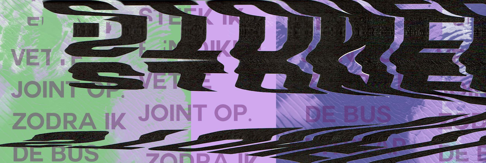

# NS Verhalen website

> Deze website biedt klanten van de NS de mogelijkheid om onderweg verhalen te lezen.
  Door je reistijd en diverse voorkeuren op te geven maakt de website voor jouw een persoonlijke
  lijst voor onderweg.

## installatie

De main folder kan direct geupload worden naar een webhost doormiddel van een FTP.
Er is nog geen robots.txt aanwezig.
Indien SEO toegepast moet worden kunnen de elementen in de <head> aangepast worden.

## Voorbeeld gebruik

Door een section met articles toe te voegen aan de index voeg je extra verhalen toe.
De CSS is zo gemaakt dat de styling automatisch overgenomen wordt.

De website is opgebouwd met display: flex;
Door op de section's display flex te genbruiken en op de children (article's)
een width van 25% te hanteren zijn deze gecentreerd in het midden.
De div id die gebruikt wordt is voor de favorieten functie, op deze manier kan
de javascript de verhalen onderscheiden.

Code samples:

<article>
      
      

      <h3> Presentator die ten onrechte denkt aansluiting te hebben gevonden bij ‘de kids </h3>
      
Meegaan met de jeugd 

      <a href="verhaal.html">&gt; Lees dit verhaal</a>
    </article>

    #index section:nth-child(5) {
        display: flex;
        margin-bottom: 7em;
    }

  #index article {
    width: 25%;
    margin: 0 1em;
    background-color: #fff;
    border-bottom: 4px solid #a5a4a4;
    position: relative;
    padding: 0 1em 3em 1em;
}

## Versies

* 0.1.1
    * Verhaal beroemd ontwikkeld
* 0.1.0
    * Resonsive design
* 0.0.1
    * Work in progress

## Meta data

Lars Breuren – LarsBreuren@gmail.com

Ontwikkel voor project WEB.

https://larsbreuren.github.io/Project-WEB/
